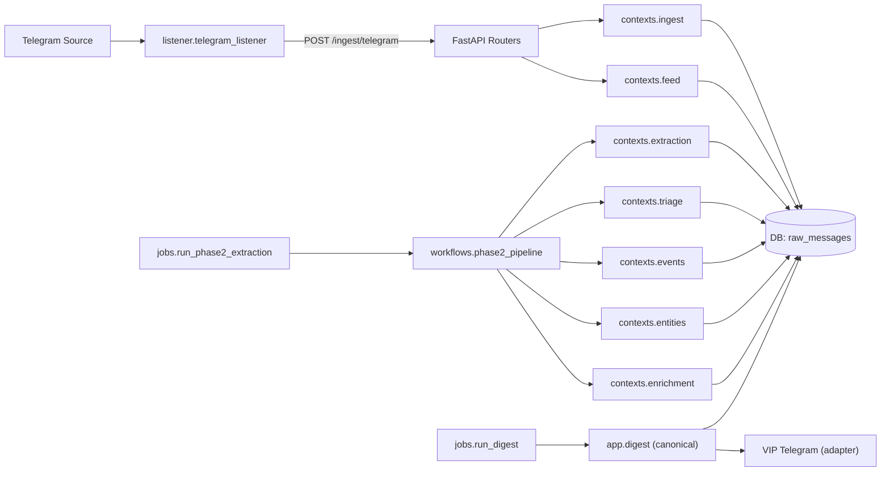

# Architecture Overview - Civicquant Intelligence Pipeline

> Legacy concise overview retained for context. Prefer `docs/architecture.md` for current canonical module ownership and boundaries.

## Purpose

Provide a concise implementation-truth overview of the current backend architecture.

## Runtime Shape

- One backend repository.
- One FastAPI app entrypoint (`app.main`).
- One shared relational database.
- Background work executed by jobs/workflows, not inline request handlers.

## Current Ownership Map

- `app/routers/*`
  - HTTP adapters only (`/ingest/*`, `/admin/*`, `/api/feed/*`).
- `app/workflows/phase2_pipeline.py`
  - Cross-context orchestration for selection, retries, leases, and run-state transitions.
- `app/contexts/ingest/*`
  - Raw source capture and idempotent raw message persistence.
- `app/contexts/extraction/*`
  - Prompt rendering, LLM client calls, strict schema validation, canonicalization, replay/content reuse logic.
- `app/contexts/triage/*`
  - Deterministic impact calibration, triage actioning, routing, and relatedness checks.
- `app/contexts/events/*`
  - Event matching/upsert and event-message relationship management.
- `app/contexts/entities/*`
  - Entity mention indexing/query helpers.
- `app/contexts/enrichment/*`
  - Enrichment candidate selection and provider seam contracts.
- `app/contexts/feed/*`
  - Feed endpoint query behavior and cursor semantics.
- `app/digest/*`
  - Canonical reporting/digest semantics, synthesis, artifact identity, and destination publication adapters.

## Transitional Compatibility

- Only digest/report shims are retained in `app/services/`:
  - `digest_builder.py`
  - `digest_query.py`
  - `digest_runner.py`
  - `telegram_publisher.py`
- These shims are thin re-export/delegation wrappers with explicit removal TODOs.

## Data Flow (Condensed)

