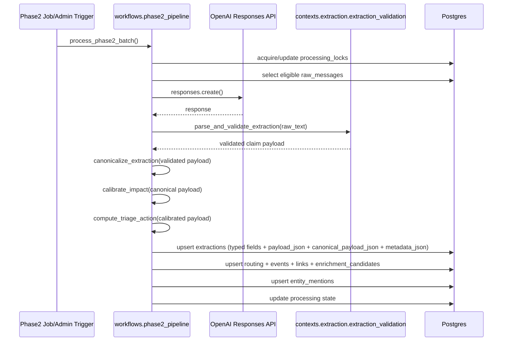

# Phase 2 Extraction Flow

## Purpose

Describe phase2 extraction as the stage that turns normalized wire bulletins into validated structured claim records and drives deterministic downstream processing.

## Phase Location in Full Pipeline

Phase2 extraction sits at the Stage 3-5 boundary:
- Stage 3: AI claim extraction
- Stage 4: deterministic triage/routing
- Stage 5: event clustering

## Current Implementation Flow

1. Trigger
- Job trigger: `python -m app.jobs.run_phase2_extraction`
- Optional admin trigger: `POST /admin/process/phase2-extractions`

2. Selection
- Acquire lock (`processing_locks`).
- Select eligible rows from `raw_messages` + `message_processing_states` (`pending`, `failed`, expired lease).

3. Extraction
- Use extractor `extract-and-score-openai-v1`.
- Compute replay identity key from raw message identity + normalized text hash + extractor/prompt/schema/canonicalizer versions.
- If replay identity matches an existing extraction row and force-reprocess is not set, reuse existing canonical extraction and skip model call.
- Else, if content-reuse is enabled, search for a prior extraction with matching normalized text hash + extractor/prompt/schema/canonicalizer contract.
- If a content-reuse match is found, reuse canonical extraction payload/hashes and skip model call.
- Otherwise call OpenAI Responses API.
- Parse and strictly validate JSON schema.
- Prompt template version: `extraction_agent_v4` (with older templates kept for reproducibility).
- Pass A payload contract includes additive structured fields:
  - `event_type`
  - `directionality`
  - controlled `tags`
  - typed `relations` (`observed` and inferred level-1 only)
  - `impact_inputs`

4. Persistence
- Write typed extraction fields for retrieval.
- Write raw validated payload in `payload_json`.
- Write deterministic canonicalized payload in `canonical_payload_json`.
- Invalid optional controlled tag/relation entries are dropped during canonicalization; core-invalid payloads still fail.
- Write deterministic hash/identity fields:
  - `normalized_text_hash`
  - `replay_identity_key`
  - `canonical_payload_hash`
  - `claim_hash`
  - `event_identity_fingerprint_v2`
- Write provider/processing telemetry in `metadata_json`.
  - Includes structured contract diagnostics (tag/relation counts and dropped optional entries).

5. Downstream deterministic processing
- Canonicalize entities/source values deterministically.
- Generate event identity fingerprint (`v2`) only after canonicalization and backend-owned derivation.
- Calibrate impact deterministically from canonical fields and rule logic (caps/boosts/band restrictions/shock gating).
  - Raw LLM `impact_score` remains trace-only in metadata.
  - Calibrated score is authoritative for triage/routing/event impact/enrichment decisions.
  - `score_band` is computed only after all caps/boosts/gating rules are applied.
- Apply deterministic summary semantic safety rewrite in canonical payload only when high-risk claim language lacks attribution.
- Compute deterministic triage output (`archive|monitor|update|promote`) and routing output.
  - Use score bands (`impact_band`, `confidence_band`) for routing decisions without mutating raw scores.
  - Apply novelty/material-change gates to downgrade repetitive low-delta follow-ons.
  - Apply burst suppression caps in short windows for highly similar related messages.
  - Apply narrow local domestic incident downgrade and evidence-required override.
- Create/update event clusters.
  - Hard-identity path: strict lookup by `event_identity_fingerprint_v2`.
  - Soft contextual matching path is used only when hard identity is unavailable.
  - Same identity + same claim hash -> no-op update.
  - Same identity + materially conflicting claim class/time bucket -> mark review-required and suppress promotion.
- Index entities to `entity_mentions` for retrieval-ready query paths.
- Run deferred enrichment selection hook with novelty filtering and persist `enrichment_candidates`.
- Sync normalized structured facets per event:
  - `event_tags`
  - `event_relations`
- Deterministic impact scoring emits `impact_score_breakdown` and `enrichment_route` (`store_only|index_only|deep_enrich`).
- Mark processing state `completed` or `failed`.

6. Pass B selective deep enrichment (separate job)
- Job trigger: `python -m app.jobs.run_deep_enrichment`
- Runs only for deterministic `deep_enrich` candidates.
- Persists narrow structured outputs in `event_deep_enrichments`:
  - `mechanism_notes`
  - `downstream_exposure_hints`
  - `contradiction_cues`
  - `offset_cues`
  - `theme_affinity_hints`

## Consumes / Produces

### Consumes
- `raw_messages.normalized_text`
- `raw_messages.message_timestamp_utc`
- `raw_messages.source_channel_name`
- phase2 runtime config and prompt template

### Produces
- `extractions` row updates/inserts
- `routing_decisions` row updates/inserts
- `events` and `event_messages` updates
- `enrichment_candidates` updates
- `event_tags` updates
- `event_relations` updates
- `event_deep_enrichments` updates (Pass B job)
- `entity_mentions` updates
- `message_processing_states` status transitions
- phase2 run logs with summary counts

## Safe Rerun Behavior and Idempotency Boundaries

- Raw messages are immutable and not rewritten by phase2 extraction.
- Completed rows are skipped by eligibility logic unless state is reset.
- If a completed/pending row is reprocessed with identical replay identity, model inference is skipped and prior canonical extraction is reused.
- If a different raw message has identical normalized text under the same extractor contract (within content-reuse window), model inference is skipped and prior canonical extraction is reused.
- Force reprocess (`/admin/process/phase2-extractions?force_reprocess=true`) bypasses both replay reuse and content reuse for that run.
- Reprocessing derived layers can be done by clearing non-raw tables and rerunning extraction.
- Full schema reset is destructive and should be used only for dev reset scenarios.

Reprocess commands:
- preserve raw: `CONFIRM_CLEAR_NON_RAW=true python -m app.jobs.clear_all_but_raw_messages`
- full reset: `python -m app.jobs.reset_dev_schema` (destructive; current script has no runtime confirmation guard)

## Claim Semantics and Uncertainty Preservation

- Extraction captures what the bulletin reports.
- Attribution/uncertainty language should remain represented in extraction output.
- `confidence` = extraction certainty.
- `impact_score` in raw payload = model-reported aggregate signal.
- Backend-calibrated impact score = operational impact used for triage/routing/event updates/enrichment selection.
- Neither field is a truth-confirmation score.

## Failure Policy

- Validation error -> `failed` state (`validation_error:*`).
- Provider error -> `failed` state (`provider_error:*`).
- No silent fallback that rewrites output as a confirmed fact.

## Sequence Diagram

