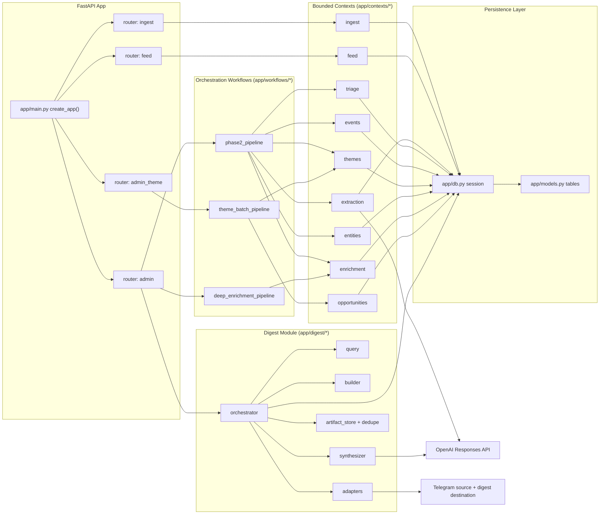

# 01 Bounded Context Map
Why this diagram matters: It shows the modular-monolith ownership boundaries so a new engineer can quickly see where HTTP entrypoints, orchestration, domain logic, and persistence responsibilities live.

Primary source files used:
- `app/main.py`
- `app/routers/ingest.py`
- `app/routers/feed.py`
- `app/routers/admin.py`
- `app/routers/admin_theme.py`
- `app/workflows/phase2_pipeline.py`
- `app/workflows/deep_enrichment_pipeline.py`
- `app/workflows/theme_batch_pipeline.py`
- `app/contexts/*`
- `app/digest/*`
- `app/db.py`
- `app/models.py`

## Reading Notes
- Routers are thin entrypoints; workflows and digest orchestrator own sequencing.
- `phase2_pipeline` coordinates multiple bounded contexts but does not duplicate their domain logic.
- `app/digest/*` is a separate orchestration lane with its own deterministic and LLM synthesis boundary.
- All durable state changes converge on SQLAlchemy models in `app/models.py`.
- OpenAI calls are isolated to extraction and digest synthesis modules.
