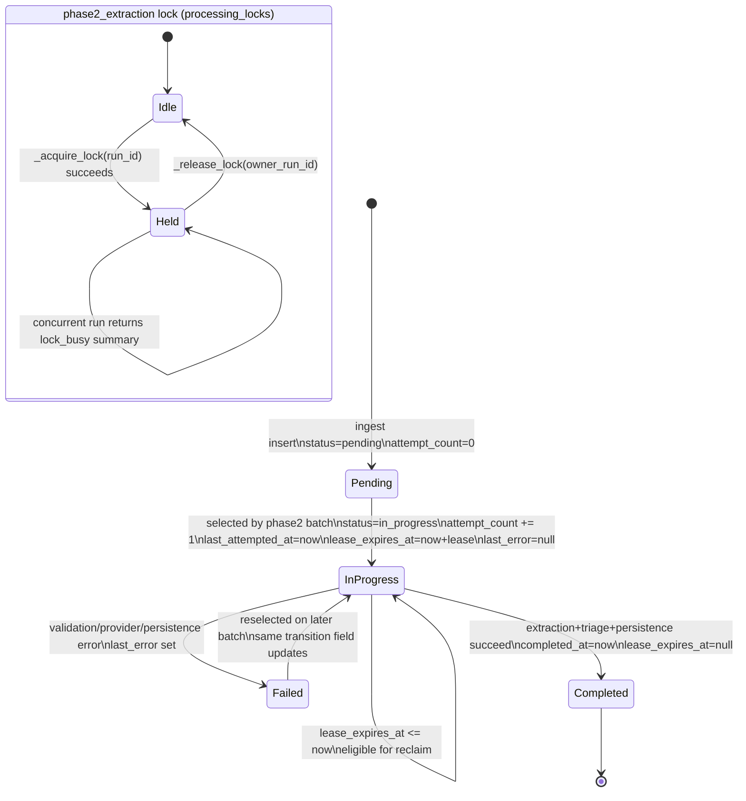

# 03 Phase2 Processing State Machine
Why this diagram matters: It captures how `message_processing_states` supports retries, lease recovery, and clear terminal outcomes while phase2 job execution is serialized by a named processing lock.

Primary source files used:
- `app/workflows/phase2_pipeline.py`
- `app/models.py`
- `docs/system-flow.md`
- `docs/data-model.md`

## Reading Notes
- The lock is run-scoped (`processing_locks`), while message status is row-scoped (`message_processing_states`).
- `in_progress` is not terminal; expired leases make those rows eligible again.
- `attempt_count` and `last_attempted_at` update before extraction work starts.
- `completed_at` only sets on success, and lease is cleared.
- Failures preserve retryability and store error class in `last_error`.
