# 04 Triage and Event Upsert Decision Flow
Why this diagram matters: This is the main logic-gate path that determines whether a message is archived, monitored, promoted, and whether it creates/updates/ignores an event.

Primary source files used:
- `app/contexts/triage/decisioning.py`
- `app/contexts/triage/triage_engine.py`
- `app/contexts/triage/relatedness.py`
- `app/contexts/triage/routing_engine.py`
- `app/contexts/events/event_manager.py`
- `app/workflows/phase2_pipeline.py`

```mermaid
flowchart TD
    A["Canonical extraction + raw_message_id"] --> B{"Strict fingerprint match?"}
    B -->|yes| C["Candidate event selected"]
    B -->|no| D{"Authoritative fingerprint and event_time?"}
    D -->|no| E["No candidate event"]
    D -->|yes| F{"Contextual match in event window?"}
    F -->|yes| C
    F -->|no| E

    C --> G["Build candidate context + recent related rows"]
    E --> G
    G --> H["Evaluate materiality and novelty\nmaterially_new + soft_related + burst_count"]

    H --> I{"Weak confidence and low impact?"}
    I -->|yes| T_ARCH["Triage outcome: archive"]
    I -->|no| J{"New event and high/critical impact and usable/strong confidence?"}
    J -->|yes| T_PRO["Triage outcome: promote"]
    J -->|no| K{"Related update and materially new?"}
    K -->|yes| T_UPD["Triage outcome: update"]
    K -->|no| T_MON["Triage outcome: monitor"]

    T_ARCH --> L{"Repeat low-delta burst?"}
    T_PRO --> L
    T_UPD --> L
    T_MON --> L
    L -->|yes| M["Burst suppression\ncap to update/monitor"]
    L -->|no| N["Keep triage action"]

    M --> O{"Local domestic incident gate?"}
    N --> O
    O -->|yes and action in promote/update| P["Downgrade triage to monitor"]
    O -->|no| Q["Final triage action"]
    P --> Q

    Q --> R["route_extraction()\ntopic destination + base priority"]
    R --> S["Apply triage/local caps\nset requires_evidence flags"]
    S --> U["Default event_action=create if summary exists else ignore"]

    U --> V{"Final triage action is archive?"}
    V -->|yes| EA_IGN["Routing outcome: event_action=ignore"]
    V -->|no| W{"Final triage action is update and candidate exists?"}
    W -->|yes| EA_UPD["Routing outcome: event_action=update"]
    W -->|no| EA_DEF["Routing outcome: event_action=create/ignore"]

    EA_IGN --> X{"event_action ignore?"}
    EA_UPD --> X
    EA_DEF --> X
    X -->|yes| OUT_IGN["Event outcome: ignore"]
    X -->|no| Y["upsert_event()"]

    Y --> Z{"Candidate exists?"}
    Z -->|no| OUT_CREATE["Event outcome: create + event_messages link"]
    Z -->|yes| AA{"Hard identity and claim_hash unchanged?"}
    AA -->|yes| OUT_NOOP["Event outcome: noop"]
    AA -->|no| AB{"Hard identity conflict\naction_class or material time_bucket shift?"}
    AB -->|yes| OUT_REVIEW["Event outcome: update_conflict review_required=true"]
    AB -->|no| OUT_UPDATE["Event outcome: update"]

    OUT_REVIEW --> AC["apply_identity_conflict_override()"]
    AC --> OUT_DOWN["Routing downgrade outcome:\ntriage=monitor\npublish_priority=none\nflag=identity_conflict_review"]
```

## Reading Notes
- Candidate lookup prefers strict fingerprint identity and only falls back to contextual matching when allowed.
- Materiality/novelty, local-incident downgrade, and burst suppression are deterministic triage gates.
- Routing priority and `requires_evidence` are derived after triage, not before it.
- Event mutation path is separate from triage and can return `create`, `update`, `noop`, or `ignore`.
- `review_required` conflicts trigger a forced routing downgrade through `apply_identity_conflict_override`.
