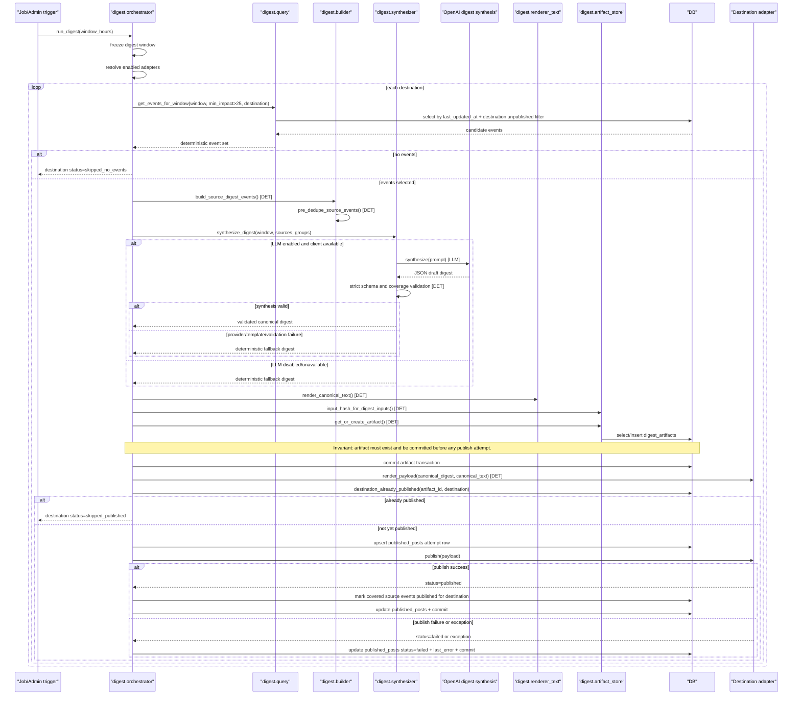

# 05 Digest Pipeline Sequence
Why this diagram matters: It documents digest construction and publication invariants, including deterministic selection, LLM synthesis fallback behavior, and artifact-first publication safety.

Primary source files used:
- `app/digest/orchestrator.py`
- `app/digest/query.py`
- `app/digest/builder.py`
- `app/digest/synthesizer.py`
- `app/digest/artifact_store.py`
- `app/digest/dedupe.py`
- `app/digest/renderer_text.py`
- `app/models.py`

## Reading Notes
- Event selection is deterministic and destination-aware (`is_published_*` filter).
- Deterministic pre-dedupe runs before any synthesis request.
- LLM synthesis is optional and guarded by strict post-validation; fallback is deterministic.
- Artifact persistence/commit is a hard invariant before publish attempts.
- Publish state is tracked per destination in `published_posts`; successful sends mark covered events as published.
