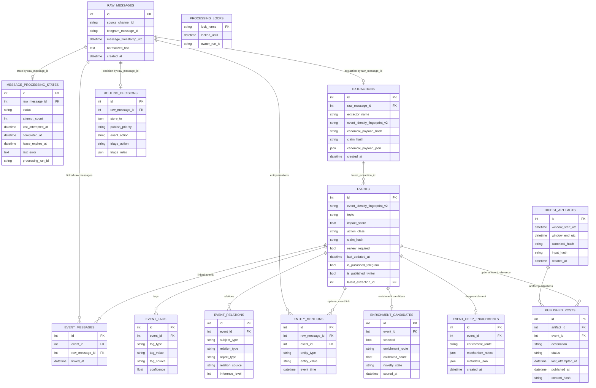

# 06 Core Operational ERD
Why this diagram matters: It provides a focused schema view for the continuous ingest/phase2 loop and digest publishing without mixing in theme-batch-only tables.

Primary source files used:
- `app/models.py`
- `docs/data-model.md`
- `app/workflows/phase2_pipeline.py`
- `app/digest/orchestrator.py`

## Reading Notes
- `raw_messages` is the ingest anchor; most continuous tables trace back to it directly or through `events`.
- `message_processing_states` is one-row-per-raw and drives phase2 eligibility and retries.
- `events.latest_extraction_id` is a nullable pointer, not a strict one-to-one contract.
- Digest publication state is artifact-centric (`digest_artifacts` -> `published_posts`).
- `processing_locks` is intentionally separate from row models and acts as workflow exclusivity control.
