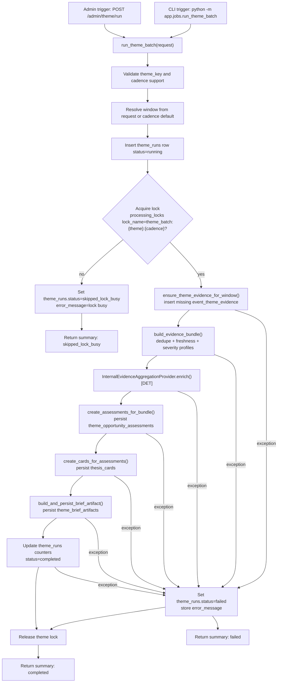

# 07 Theme Batch Pipeline
Why this diagram matters: It shows the full batch orchestration path, including cadence/window resolution, lock behavior, evidence catch-up, and run status outcomes.

Primary source files used:
- `app/routers/admin_theme.py`
- `app/jobs/run_theme_batch.py`
- `app/workflows/theme_batch_pipeline.py`
- `app/contexts/themes/evidence.py`
- `app/contexts/themes/bundle.py`
- `app/contexts/opportunities/providers.py`
- `app/contexts/opportunities/assessment.py`
- `app/contexts/opportunities/thesis_cards.py`
- `app/contexts/opportunities/briefs.py`

## Reading Notes
- Theme batch can be triggered from API or CLI, but both paths converge on `run_theme_batch`.
- The workflow always creates a `theme_runs` row first, then decides `completed`, `failed`, or `skipped_lock_busy`.
- Locking is per theme and cadence (`theme_batch:{theme}:{cadence}`), not global.
- Enrichment in this pipeline is internal deterministic aggregation, not an external LLM call.
- Evidence is reusable (`event_theme_evidence`), while assessments/cards/brief are run-scoped outputs.
