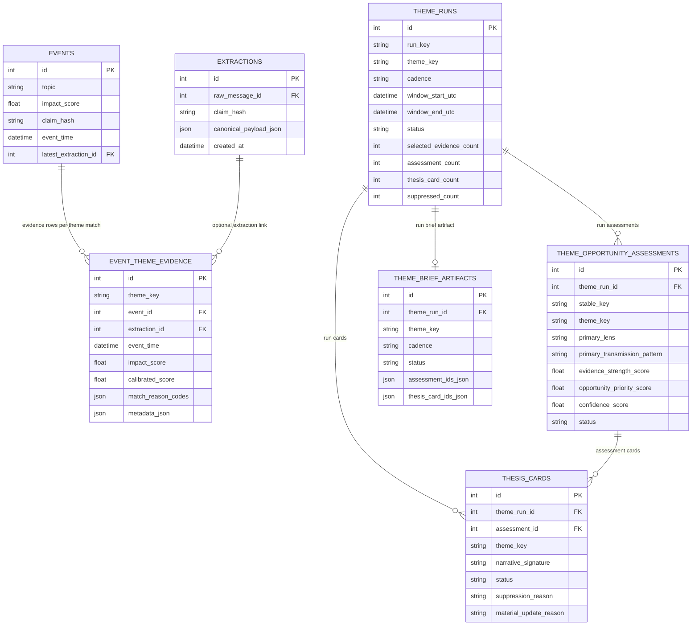

# 08 Theme Batch ERD
Why this diagram matters: It separates reusable theme evidence from per-run analytical outputs so engineers can reason about persistence scope and lineage.

Primary source files used:
- `app/models.py`
- `app/workflows/theme_batch_pipeline.py`
- `app/contexts/themes/evidence.py`
- `app/contexts/opportunities/assessment.py`
- `app/contexts/opportunities/thesis_cards.py`
- `app/contexts/opportunities/briefs.py`

## Reading Notes
- `event_theme_evidence` is derived from operational events and can be reused across multiple theme runs.
- `theme_runs` is the batch execution anchor for statuses and aggregate counts.
- Assessments and cards are tied to a specific run via FK, even when content is similar across windows.
- `theme_brief_artifacts` is one-per-run (`theme_run_id` unique).
- Evidence-to-assessment linkage is currently by stored IDs in JSON payloads, not FK join tables.
