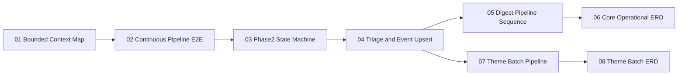

# Diagrams Index
Why this diagram matters: This index maps the smallest high-value diagram set that makes the pipeline legible end-to-end, including control loops, gating logic, and persistence contracts.

Primary source files used:
- `docs/README.md`
- `docs/architecture.md`
- `docs/system-flow.md`
- `docs/data-model.md`
- `app/main.py`
- `app/models.py`
- `app/workflows/phase2_pipeline.py`
- `app/workflows/theme_batch_pipeline.py`
- `app/digest/orchestrator.py`

## Diagram Catalog
1. [01-bounded-context-map.md](./01-bounded-context-map.md)
Purpose: Show module ownership boundaries in the modular monolith.
Why it matters: Makes it clear where orchestration lives versus where domain logic and persistence live.
Primary source files used: `app/main.py`, `app/routers/*.py`, `app/workflows/*.py`, `app/contexts/*`, `app/digest/*`, `app/db.py`, `app/models.py`.
What question it answers: "Which parts of the codebase own ingest, phase2, digest, and theme-batch behavior?"

2. [02-continuous-pipeline-e2e.md](./02-continuous-pipeline-e2e.md)
Purpose: Trace runtime from ingest through extraction, triage, eventization, indexing, and enrichment candidate selection.
Why it matters: Shows the exact write-path and gate ordering for the continuous pipeline.
Primary source files used: `app/routers/ingest.py`, `app/contexts/ingest/ingest_pipeline.py`, `app/workflows/phase2_pipeline.py`, `app/contexts/extraction/processing.py`, `app/contexts/events/event_manager.py`.
What question it answers: "What happens to a message after ingest, and which steps are deterministic versus LLM-assisted?"

3. [03-phase2-processing-state-machine.md](./03-phase2-processing-state-machine.md)
Purpose: Model `message_processing_states` transitions and phase2 lock behavior.
Why it matters: Clarifies retry/lease semantics and why rows can be reprocessed.
Primary source files used: `app/workflows/phase2_pipeline.py`, `app/models.py`.
What question it answers: "How does a message move from `pending` to terminal states, and when is it re-eligible?"

4. [04-triage-and-event-upsert-decision-flow.md](./04-triage-and-event-upsert-decision-flow.md)
Purpose: Make the triage + routing + event-upsert logic gates inspectable.
Why it matters: This is the highest-risk logic for false promotion, suppression, and review downgrades.
Primary source files used: `app/contexts/triage/decisioning.py`, `app/contexts/triage/triage_engine.py`, `app/contexts/triage/routing_engine.py`, `app/contexts/events/event_manager.py`.
What question it answers: "Why did a message become archive/monitor/update/promote, and what event mutation followed?"

5. [05-digest-pipeline-sequence.md](./05-digest-pipeline-sequence.md)
Purpose: Show selection, synthesis, artifact persistence, and publish semantics per destination.
Why it matters: Captures digest invariants, including commit-before-publish and dedupe behavior.
Primary source files used: `app/digest/orchestrator.py`, `app/digest/query.py`, `app/digest/builder.py`, `app/digest/synthesizer.py`, `app/digest/artifact_store.py`, `app/digest/dedupe.py`.
What question it answers: "How is a digest artifact produced safely and published without duplicate sends?"

6. [06-core-operational-erd.md](./06-core-operational-erd.md)
Purpose: Provide the operational schema view for continuous processing and digest publishing.
Why it matters: Gives new engineers a trusted map of core tables and FK-backed links.
Primary source files used: `app/models.py`, `docs/data-model.md`.
What question it answers: "Which core tables exist, and how are they related in live processing?"

7. [07-theme-batch-pipeline.md](./07-theme-batch-pipeline.md)
Purpose: Show theme batch orchestration from trigger to evidence, assessments, cards, and brief artifact.
Why it matters: Clarifies lock, cadence/window handling, and run outcomes.
Primary source files used: `app/routers/admin_theme.py`, `app/jobs/run_theme_batch.py`, `app/workflows/theme_batch_pipeline.py`, `app/contexts/themes/*`, `app/contexts/opportunities/*`.
What question it answers: "What exactly happens when a theme batch run is triggered?"

8. [08-theme-batch-erd.md](./08-theme-batch-erd.md)
Purpose: Show theme-batch persistence model and where it links to operational entities.
Why it matters: Distinguishes reusable evidence storage from per-run assessment/card/brief outputs.
Primary source files used: `app/models.py`, `app/workflows/theme_batch_pipeline.py`, `app/contexts/themes/evidence.py`.
What question it answers: "How do theme runs, evidence, assessments, cards, and briefs connect?"

## Reading Notes
- Read `01` first, then `02` to understand runtime, and `03`/`04` for control gates.
- Use `05` before touching digest behavior; it captures the publish invariants.
- `06` and `08` are schema references; keep them open while tracing code paths.
- `07` is the operational lens for batch thematic runs and their statuses.
